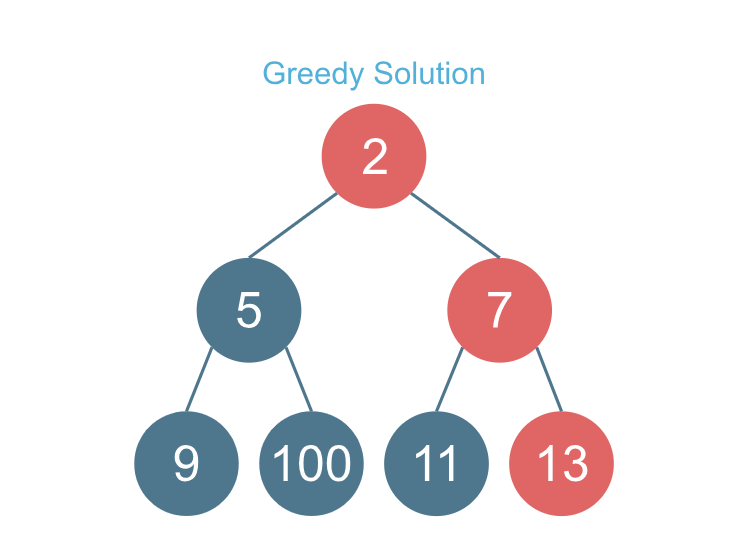

# Greedy Algorithms
__Learn how greedy algorithms are used to solve problems.__

A greedy algorithm is an algorithm used in optimization problems, which aim to find the optimal solution (either the maximum or the minimum) among all feasible solutions. For example, finding the shortest path between two locations on the map is an optimization problem that aims to minimize the result.

In order to reach the optimal solution, a greedy algorithm makes the locally optimal choice at each stage. Just like greedy people, they only consider the choice that seems to be the best at that moment. Although it can be useful in some problems, a greedy algorithm does NOT always produce an optimal solution.

In this article, we will cover how greedy algorithms work, their pros and cons, and when to use them.

## Greedy Algorithms in the Real World
Suppose you are a hiring manager at a tech company and a new position just opened. You need to select the most qualified person among 200 candidates through a three-stage hiring process:

1. Online assessment
2. Phone interview
3. Technical interview

If you wanted to be fair to everyone, you would have all 200 candidates go through the entire hiring process. However, this brute force approach would use a lot of the company’s time and resources.

Instead, you can use the greedy approach to filter the list of candidates stage by stage. This would work by giving every candidate the online assessment, but only allowing the top 50% of scorers to move on. Then, selecting the twenty candidates who gave the best first impression during the phone interview. Finally, after conducting the technical interview with the remaining twenty people, offering the best candidate a position in the company.

The greedy approach is more efficient here because the number of candidates significantly reduces after each stage. It also makes sense to eliminate the low scorers early on as they probably would not perform well in the later stages anyways.

## Largest Tree Path
We are given a binary tree with the goal of finding the root-to-leaf path with the largest sum.

The greedy algorithm will choose the largest number at each step, so it will choose `7` over `5` at the second step, then choose `13` over `11` at the third step.

In the end, the greedy algorithm gives us the path `2 -> 7 -> 13 = 22`. Can we do better than this?

Yes, we can! It should be obvious to us that the optimal path is `2 -> 5 -> 100 = 107`. Intuitively, no other nodes in the tree come close to `100`, so no matter which path we choose, it must include `100`. However, a greedy algorithm could never achieve this solution because it will always choose `7` over `5` at the second step, making it impossible to reach `100`.

As you can see from this example, a greedy algorithm does NOT always achieve the global optimal solution. This is because greedy algorithms make decisions purely based on the best choice at the time, without regard to the overall problem.

### Multiple choice
A greedy algorithm attempts to compute the optimal solution by:

* Going through all available choices and picking the best one.

* (Selected)Correct:
Picking the best available choice at that moment.

* Solving all subproblems and combining the results.

* Picking a random choice at each stage.

👏
Correct! This is known as making the locally optimal choice.

## When to use greedy algorithms
We must be careful when using greedy algorithms because they are not guaranteed to be correct. A problem that can be correctly solved by a greedy algorithm must satisfy these two properties:

* Optimal substructure property - the optimal solution for the problem contains optimal solutions to the sub-problems.
* Greedy property - the global optimal solution can be reached by making locally optimal choices.

## Pros and Cons
Greedy algorithms have the following advantages:

* Easy to understand and implement.
* Time and space complexities are easy to analyze.
* Perform better than other paradigms like divide-and-conquer.

However, there are some crucial disadvantages:

* Most greedy algorithms fail to find the global optimal solution.
* Hard to prove the correctness of a greedy algorithm.

If a greedy algorithm is proven to be correct, it generally becomes the best method for solving optimization problems because it is faster than other techniques. Some of the common applications for greedy algorithms include pathfinding, graph search, and data compression.

### Multiple choice
Which of the following statements about the greedy algorithm is true?

* (Selected)Correct: A greedy algorithm can only correctly solve certain classes of optimization problems

* A greedy algorithm will always correctly solve an optimization problem.

* Greedy algorithms are inefficient compared to other algorithms like divide-and-conquer.

* Greedy algorithms will sometimes reverse past decisions.

👏
Correct! A problem must satisfy the optimal substructures and the greedy property for a greedy algorithm to work.

## Review
Let’s review what we learned about greedy algorithms:

* A greedy algorithm builds up a solution for an optimization problem by making the best decision at each step.
* Greedy algorithms are simple and efficient but are NOT always correct.
* In order for a greedy algorithm to work, a problem must satisfy:
  * The optimal substructure property
  * The greedy property
