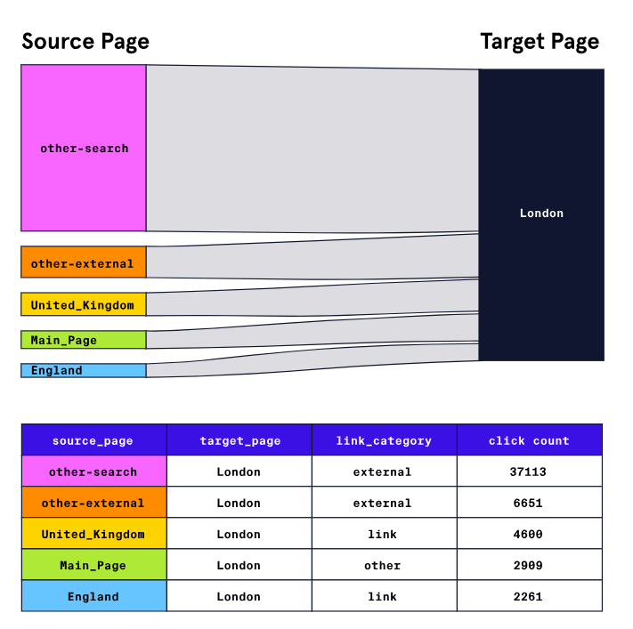

DATA ENGINEER
# Analyzing Wikipedia Clickstreams with PySpark

In this project, we’re going to continue working with Wikipedia’s open-source datasets. Wikipedia maintains a dataset called “Clickstream” that records clicks between pairs of linked Wikipedia articles. Because not all readers arrive at a Wikipedia article by clicking a link from another, the dataset also includes categories for clicks that originate outside of Wikipedia (e.g., `external-search` tracks all clicks coming from major search engines).



Sankey diagram showing the source pages for the London target page on Wikipedia. Click counts for the source pages run in descending order: other-search 37,113; other-external 6651; United_Kingdom 4600; Main_Page 2909; England 2261.

This excerpt tells us about 37,000 people accessed the page for `London` from an external search engine, and about 4,600 people accessed the page by clicking on a link from the Wikipedia article titled “United Kingdom”. In this project, we’ll clean and analyze a sample of the English language Wikipedia’s Clickstream data from January 2018 using PySpark SQL.


## Starting Spark and Introduction to Clickstream Data
1. Before we can load or query this data, we’ll need to create a `SparkSession`. Create a new `SparkSession` and assign it to a variable named `spark`.


2. Use the `SparkSession` you’ve just created and the sample data from below to create an RDD. This data is a rough estimate of Clickstream counts for the article “Hanging_Gardens_of_Babylon”. Later in the project we’ll verify these counts with an analysis of the full data.
```py
sample_clickstream_counts = [
    ["other-search", "Hanging_Gardens_of_Babylon", "external", 47000],
    ["other-empty", "Hanging_Gardens_of_Babylon", "external", 34600],
    ["Wonders_of_the_World", "Hanging_Gardens_of_Babylon", "link", 14600],
    ["Babylon", "Hanging_Gardens_of_Babylon", "link", 2500]
]
```

3. Using the RDD you created in the previous step, create a DataFrame named `clickstream_sample_df` with the following column names:

* source_page
* target_page
* link_category
* link_count

## Inspecting Clickstream Data
4. Read the files in `./cleaned/clickstream/` into a new Spark DataFrame named `clickstream`. The raw clickstream data uses tab (`\t`) as a delimiter and has a header with column names. Once you’ve loaded the data, display the first few rows of the DataFrame in the notebook.


5. Print the schema of the DataFrame in the notebook. Do all the data types look correct?

6. Because we’re only analyzing data from the English language Wikipedia, we can remove the language code column. Drop this column from the DataFrame and display the new schema in the notebook.

7. The column names `referrer` and `resource` can be a bit confusing to someone not familiar with this dataset. Rename them to `source_page` and `target_page`, respectively, and display the first few rows and DataFrame schema in the notebook.


## Querying Clickstream Data
8. In the following exercises, we’re going to perform a few queries against the `clickstream` DataFrame using PySpark DataFrame methods and SQL. Add the `clickstream` DataFrame as a temporary view named `clickstream` so we can use SQL to perform analysis against it.


9. Earlier in the project we created an RDD using approximated data, let’s check the real data to see how close that estimate was. Filter the dataset to entries with `Hanging_Gardens_of_Babylon` as the `target_page` and order the result by `click_count` using PySpark DataFrame methods.


10. Perform the same analysis as the previous exercise using a SQL query. Display your results in the notebook to confirm both methods yielded the same results.


11. Are more readers directed to articles through intra-article links, external searches, or other methods? We can answer this question by calculating the sum of `click_count` and grouping by `link_category` across the entire dataset. First, try to get to a solution using PySpark DataFrame methods.


12. Perform the same analysis as the previous exercise using a SQL query. Display your results in the notebook to confirm both methods yielded the same results.


## Saving Results to Disk
13. Let’s create a new DataFrame named `internal_clickstream` that only contains article pairs where `link_category` is `link`. Because we’re filtering on that column, we should also limit the new DataFrame’s columns to just “source_page”, “target_page”, and “click_count” columns. Display the first few rows and DataFrame schema in the notebook.


14. Save the `internal_clickstream` DataFrame as CSV files in a directory called `./results/article_to_article_csv/`. If you read this CSV file back from disk without specifying any options to the reader, will it be identical to the DataFrame you just saved?


15. Save the `internal_clickstream` DataFrame as parquet files in a directory called `./results/article_to_article_pq/`. Parquet is Spark’s default file format and offers efficient data compression, is faster to perform analysis with than CSV, and preserves information about a dataset’s schema on disk.


16. Now that we’ve saved the results of our work, we should close the `SparkSession` and underlying `sparkContext`. What would happen if you were to try to call `clickstream.show()` after closing the `SparkSession`?