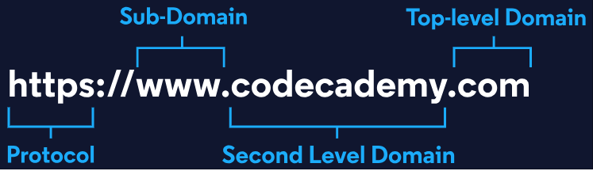

# Analyze Common Crawl Data with PySpark
[The Common Crawl](https://commoncrawl.org/) is a non-profit organization that crawls, archives, and analyzes content on all public websites. The Common Crawl maintains petabytes (thousands of terabytes!) of web content and insights derived from their analyses, all of which is made publicly available for research and educational purposes.

In this project, we’re going to be working with a small portion of a dataset published by the Common Crawl. Analyzing Common Crawl data can be easier if you know a few key facts about the format of domain names. Every website’s name is composed of multiple parts, as illustrated in the following diagram:

The dataset we’ll be working with, the domain graph, contains a record of every domain on the internet and the count of subdomains associated with the site.

## Analyzing Domain Counts With PySpark RDD
1. One of your colleagues has made good progress analyzing this dataset using only PySpark RDDs, but has asked you to continue work on this project with SparkSQL. To get familiar with the dataset, you should run their analysis.

Run the notebook cell that initializes a new `sparkContext` and reads the domain graph CSV file as an RDD. Display the first 10 entries of this file in the notebook.

2. Your colleague has written a function called `fmt_domain_graph_entry` that formats an entry in the domain dataset. Apply this function to `common_crawl_domain_counts` and save it as a new RDD called `formatted_host_counts`. Display the first 10 entries in the notebook.

3. Your colleague has written another function called `extract_domain_graph_host_count`. Apply this function to `common_crawl_domain_counts` and save the result to an RDD named `host_counts`. Study the function, what do you think the result will look like? Display the first 10 entries in this file in the notebook.

4. Using `host_counts`, calculate the total number of subdomains in the dataset, and save the result to a variable named `total_host_counts`.

5. We can do a bit more analysis more easily with PySpark SQL. Stop the current SparkSession and SparkContext before starting on our SparkSQL analysis.

## Exploring Domain Counts with PySpark DataFrames and SQL
6. Before we can load or query this data for ourselves, we’ll need to create a `SparkSession`. Create a new `SparkSession` and assign it to a variable named `spark`.

7. Read `./crawl/cc-main-limited-domains.csv` into a new Spark DataFrame named `common_crawl`. This dataset doesn’t have headers, so we can use Spark’s auto-generated column names for now. Once you’ve loaded the data, display the first few rows of the DataFrame in the notebook.

8. Because this dataset doesn’t have headers, we’ll have to set them ourselves. Let’s rename the autogenerated columns to the following:

* site_id
* domain
* top_level_domain 
* num_subdomains

## Reading and Writing Datasets to Disk
9. Before moving on to analyzing this dataset, let’s save it as parquet files. This will help our other colleagues work with it more easily. Save the `common_crawl` DataFrame as parquet files in a directory called `./results/common_crawl/`.

10. That’s a much better format for this dataset. Read `./results/common_crawl/` into a new DataFrame to confirm our DataFrame was saved properly. Display the first few rows of the new DataFrame and the schema in the notebook.

## Querying Domain Counts with PySpark DataFrames and SQL
11. Answer the next few questions using either DataFrame methods or PySpark SQL. If you’d like extra practice, you can try using both methods. If you’d like to use SQL, initialize a temporary view from the `common_crawl_domains` DataFrame named `crawl`.

12. Calculate the total number of subdomains for each top-level domain in the dataset, and order your result from highest to lowest total subdomain count.

13. From this dataset, we can also determine which top-level domains contain the most subdomains. Calculate the total number of subdomains for each top-level domain in the dataset and order your result from highest to lowest total subdomain count.

14. Let’s say our analysis is particularly interested in the number of subdomains maintained by different government agencies. Filter the dataset to the website of the United States National Parks Service (domain: `nps`, top-level domain: `gov`) and display the columns top_level_domain, domain, and num_subdomains in your result.

15. Now that we’ve finished our exploration, we should close the `SparkSession` and underlying `sparkContext`.