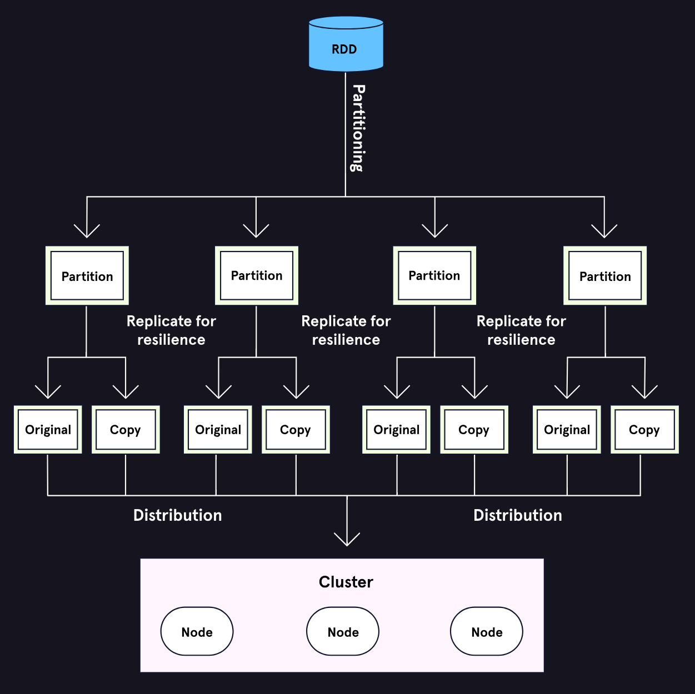

# PySpark Overview

* RDDs are the foundational data structure of Spark
* RDDs are fault-tolerant, partitioned, and operated on in parallel
* Transformations are lazy and do not execute until an action is called

